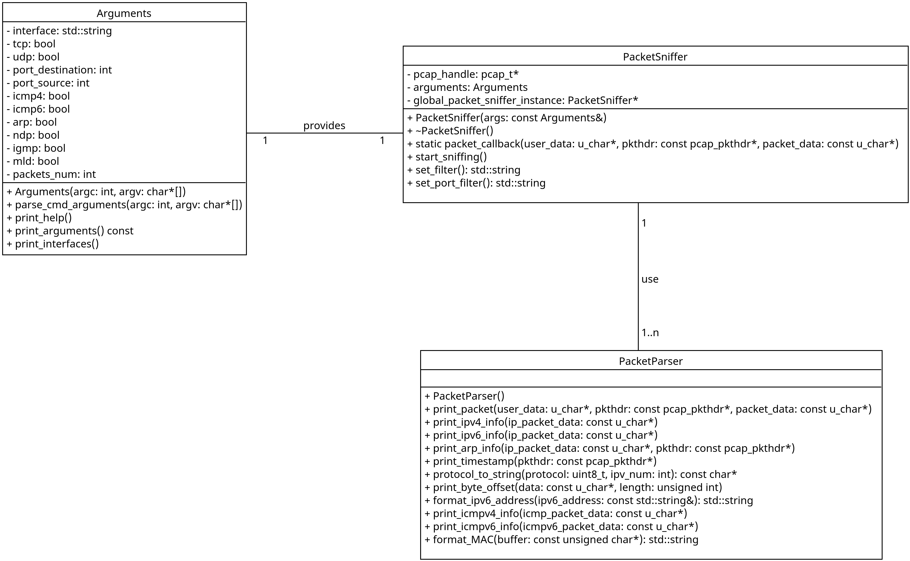

# Network Sniffer Documentation

This documentation describes an implementation of the network analyzer that is capturing and filtering packets on a specific network interface - `Network Sniffer`. The `Network Sniffer` is implemented in `C++` making strong use of `PCAP (Packet Capture)` library.

## Table of Contents

- [Network Sniffer Documentation](#network-sniffer-documentation)
  - [Table of Contents](#table-of-contents)
  - [Theory](#theory)
    - [Network Sniffing](#network-sniffing)
    - [PCAP library](#pcap-library)
    - [Protocols and Headers](#protocols-and-headers)
  - [Usage](#usage)
  - [Source code](#source-code)
    - [Arguments](#arguments)
    - [PacketSniffer](#packetsniffer)
    - [PacketParser](#packetparser)
    - [UML Class Diagram](#uml-class-diagram)
    - [Interaction flow](#interaction-flow)
  - [Testing](#testing)
    - [Testing enviroment](#testing-enviroment)
    - [Command-line argument](#command-line-argument)
    - [Setting up the filter](#setting-up-the-filter)
    - [Capturing and printing the packets](#capturing-and-printing-the-packets)

## Theory

This section will briefly describe the theory necessary for full understanding how does the `Network Sniffer` work.

### Network Sniffing

Network sniffing is the process of intercepting and logging network traffic passing through a network interface. By capturing packets, network sniffers enable analysis of network activity. Captured packets can be analyzed to extract information such as source and destination addresses, protocol types, payload contents, etc.

### PCAP library

`Packet Capture` library is broadly used framework for capturing, filtering  and analyzing network packets. It provides a platform-independent interface for accessing network data at the packet level.
> Visit [tcpdump.org](https://www.tcpdump.org/) for more information.

### Protocols and Headers

Network packets are structured according to various protocols, each with its own header format. Common protocols include `TCP`, `UDP`, `ICMP` and `ARP`, each with specific header fields defining packet attributes. While interpreting packet data, the most crucial part is understanding protocol headers.

## Usage

**Usage** of the Network Sniffer is:

```./ipk-sniffer [-i interface | --interface interface] {-p|--port-source|--port-destination port [--tcp|-t] [--udp|-u]} [--arp] [--ndp] [--icmp4] [--icmp6] [--igmp] [--mld] {-n num}```

where supported command line arguments can be in any order and are described as follows:

| Option                  | Description                                                                                                                  |
|-------------------------|------------------------------------------------------------------------------------------------------------------------------|
| `-i eth0`               | Specifies the network interface to sniff.                                                                                    |
| `--interface eth0`      | Specifies the network interface to sniff.                                                                                    |
| `-t`, `--tcp`           | Displays TCP segments.                                                                                                       |
| `-u`, `--udp`           | Displays UDP datagrams.                                                                                                      |
| `-p`                    | Extends previous two parameters to filter TCP/UDP based on port number.                                                      |
| `--port-destination 23` | Extends previous two parameters to filter TCP/UDP based on destination port number.                                          |
| `--port-source 23`      | Extends previous two parameters to filter TCP/UDP based on source port number.                                               |
| `--icmp4`               | Displays only ICMPv4 packets.                                                                                                |
| `--icmp6`               | Displays only ICMPv6 echo request/response.                                                                                  |
| `--arp`                 | Displays only ARP frames.                                                                                                    |
| `--ndp`                 | Displays only NDP packets, subset of ICMPv6.                                                                                 |
| `--igmp`                | Displays only IGMP packets.                                                                                                  |
| `--mld`                 | Displays only MLD packets, subset of ICMPv6.                                                                                 |
| `-n 10`                 | Specifies the number of packets to display. If not specified, only one packet is displayed.                                  |

## Source code

The source code contains three classes: `Arguments`, `PacketSniffer`, and `PacketParser`, that are designed to provide packet capturing and analysis. In the following section will be each class shortly described, for a deeper understanding of implemented methods, please refer to the source code files, where each method is thoroughly described.

### Arguments

- Responsible for parsing command-line arguments.
- Stores information about network interface, protocol preferences, packet filters, and packet count.
- Offers methods to print help information and available network interfaces.

### PacketSniffer

- Initializes and manages packet sniffing using libpcap.
- Provides a callback function `packet_callback` to process captured packets.
- Offers methods to start and stop packet sniffing.

### PacketParser

- Handles parsing and printing of packet information.
- Provides methods to print packet headers, timestamps, and byte offsets.
  
### UML Class Diagram

UML Class Diagram to display the communication between classes.


### Interaction flow

This is the simplified representation of the flow while running the `Network Sniffer`:

```text
Main
 |
 |   Arguments
 |     |
 |     | Parse command-line arguments
 |     v
 |   PacketSniffer
 |     |
 |     | Create PacketSniffer instance with parsed arguments
 |     v
 |     Start sniffing
 |       |
 |       | Packet capture callback
 |       v
 |     PacketParser
 |       |
 |       | Print captured packet information
 |       v
 |     PacketSniffer
 |       |
 |       | Continue sniffing / N packets captured - stop sniffing
 |       v
 ```

## Testing

In this section will be displayed the program outputs for specific tested scenarios. The testing of `Network Sniffer` was done with the usage of the program `Wireshark` where captured packets were compared to the data of the same packet captured by the `Wireshark`.

### Testing enviroment

The testing part was done in the terminal of the computer with following specification:

`Linux MiWiFi-R4CM-srv 6.7.10-200.fc39.x86_64 #1 SMP PREEMPT_DYNAMIC Mon Mar 18 18:56:52 UTC 2024 x86_64 GNU/Linux`

The used g++ compiler:

```text
g++ (GCC) 13.2.1 20240316 (Red Hat 13.2.1-7)
Copyright (C) 2023 Free Software Foundation, Inc.
This is free software; see the source for copying conditions.  There is NO
warranty; not even for MERCHANTABILITY or FITNESS FOR A PARTICULAR PURPOSE.
```

The network interfaces and their configurations (IP and MAC addresses are not shown whole from security reasons):

```text
1: lo: <LOOPBACK,UP,LOWER_UP> mtu 65536 qdisc noqueue state UNKNOWN group default qlen 1000
    link/loopback 00:00:00:00:XX:XX brd 00:00:00:00:XX:XX
    inet 127.0.0.1/8 scope host lo
       valid_lft forever preferred_lft forever
    inet6 ::1/128 scope host noprefixroute 
       valid_lft forever preferred_lft forever
2: enp0s31f6: <BROADCAST,MULTICAST,UP,LOWER_UP> mtu 1500 qdisc fq_codel state UP group default qlen 1000
    link/ether 28:f1:0e:2d:XX:XX brd ff:ff:ff:ff:XX:XX
    inet 192.168.XX.XXX/XX brd 192.168.XX.XXX scope global dynamic noprefixroute enp0s31f6
       valid_lft 38708sec preferred_lft 38708sec
    inet6 fe80::14f1:97d6:c1fd:XXXX/XX scope link noprefixroute 
       valid_lft forever preferred_lft forever
3: wlp1s0: <BROADCAST,MULTICAST,UP,LOWER_UP> mtu 1500 qdisc noqueue state UP group default qlen 1000
    link/ether e4:a4:71:82:XX:XX brd ff:ff:ff:ff:XX:XX
    inet 192.168.XX.XX/XX brd 192.168.XX.XXX scope global dynamic noprefixroute wlp1s0
       valid_lft 38710sec preferred_lft 38710sec
    inet6 fe80::56db:2d6:7e21:XXXX/XX scope link noprefixroute 
       valid_lft forever preferred_lft forever
```

### Command-line argument

The first thing to be tested is correct command-line argument parsing and setting corresponding flags for later filtering

**The following text snippets will contain an examples of console inputs/outputs while running the `Network Sniffer` with different command-line arguments.**

Test for the accurate setting of the flags for different arguments (print for each flag was added to see the correct functionality):

```text
sudo ./ipk-sniffer --interface lo --tcp --udp --icmp6 --port-source 23 --igmp --arp -n 13
interface: lo
tcp: 1
udp: 1
port_destination: -1
port_source: 23
icmp4: 0
icmp6: 1
arp: 1
ndp: 0
igmp: 1
mld: 0
packets_num: 13
```

Test for the usage of the `Network Sniffer` without specified interface:

```text
sudo ./ipk-sniffer --interface
No interface specified, use one of the following active interfaces:
wlp1s0
any
lo
```

Test for the usage of the `Network Sniffer` with unknown argument:

```text
sudo ./ipk-sniffer --interface --tcp --udp --protocol321
Unknown argument. For more information run ./ipk-sniffer -h / --help.
```

### Setting up the filter

Another part of the program to be thoroughly tested is setting up the `PCAP filter` from the command-line arguments to capture only necessary packets.

**The following text snippets will contain an examples of created `filter` while running the `Network Sniffer` with different command-line arguments.**

Test for the filter  with only basic arguments:

```text
sudo ./ipk-sniffer --interface wlp1s0 --tcp --udp
filter: (tcp) or (udp)
```

Test for the more complex filter with more arguments:

```text
sudo ./ipk-sniffer --interface wlp1s0 --tcp --udp --icmp4 --ndp --arp
filter: (tcp) or (udp) or (icmp) or (arp) or (icmp6 and (icmp6[0] == 133 or icmp6[0] == 134 or icmp6[0] == 135 or icmp6[0] == 136 or icmp6[0] == 137))
```

Test for the filter with specified port numbers (src port = 87 and dst port = 34):

```text
sudo ./ipk-sniffer --interface wlp1s0 --tcp --udp --port-destination 34 --port-source 87
filter: ((tcp) and (dst port 34 or src port 87)) or ((udp) and (dst port 34 or src port 87))
```

### Capturing and printing the packets

The last and most important part to be thoroughly tested is actuall capturing of the packets and printing them with necessary informations. The testing was done by capturing specific packets and then comparing them with the same packet captured by `Wireshark`.

**The following text snippets will contain an examples of captured `packets` while running the `Network Sniffer` and comparison to the `Wireshark` output of the packet.**

Test for capturing the `ICMPv4` packet send by using `ping 127.0.0.1`:

```text
sudo ./ipk-sniffer --interface lo --icmp4
timestamp: 2024-04-21T14:47:03.690+0200
src MAC: 00:00:00:00:00:00
dst MAC: 00:00:00:00:00:00
frame length: 98 bytes
src IP: 127.0.0.1
dst IP: 127.0.0.1
protocol: ICMPv4
ICMPv4 type: 8
ICMPv4 code: 0
00000000: 00 00 00 00 00 00 00 00 00 00 00 00 08 00 45 00   ..............E.
00000010: 00 54 2a 8b 40 00 40 01 12 1c 7f 00 00 01 7f 00   .T*.@.@.........
00000020: 00 01 08 00 ee 2b 00 07 00 01 c7 0a 25 66 00 00   .....+......%f..
00000030: 00 00 54 88 0a 00 00 00 00 00 10 11 12 13 14 15   ..T.............
00000040: 16 17 18 19 1a 1b 1c 1d 1e 1f 20 21 22 23 24 25   .......... !"#$%
00000050: 26 27 28 29 2a 2b 2c 2d 2e 2f 30 31 32 33 34 35   &'()*+,-./012345
00000060: 36 37                                             67
-----------------------------------------------------------------------------

Wireshark hex dump:
0000   00 00 00 00 00 00 00 00 00 00 00 00 08 00 45 00
0010   00 54 2a 8b 40 00 40 01 12 1c 7f 00 00 01 7f 00
0020   00 01 08 00 ee 2b 00 07 00 01 c7 0a 25 66 00 00
0030   00 00 54 88 0a 00 00 00 00 00 10 11 12 13 14 15
0040   16 17 18 19 1a 1b 1c 1d 1e 1f 20 21 22 23 24 25
0050   26 27 28 29 2a 2b 2c 2d 2e 2f 30 31 32 33 34 35
0060   36 37
```

Test for capturing `ICMPv6` packet send by using `ping6 ::1`:

```text
sudo ./ipk-sniffer --interface lo --icmp6
timestamp: 2024-04-21T19:46:03.464+0200
src MAC: 00:00:00:00:00:00
dst MAC: 00:00:00:00:00:00
frame length: 118 bytes
src IP: ::1
dst IP: ::1
protocol: ICMPv6
ICMPv6 type: 128
ICMPv6 code: 0
00000000: 00 00 00 00 00 00 00 00 00 00 00 00 86 dd 60 02   ..............`.
00000010: 27 08 00 40 3a 40 00 00 00 00 00 00 00 00 00 00   '..@:@..........
00000020: 00 00 00 00 00 01 00 00 00 00 00 00 00 00 00 00   ................
00000030: 00 00 00 00 00 01 80 00 5a cd 00 17 00 01 db 50   ........Z......P
00000040: 25 66 00 00 00 00 5e 14 07 00 00 00 00 00 10 11   %f....^.........
00000050: 12 13 14 15 16 17 18 19 1a 1b 1c 1d 1e 1f 20 21   .............. !
00000060: 22 23 24 25 26 27 28 29 2a 2b 2c 2d 2e 2f 30 31   "#$%&'()*+,-./01
00000070: 32 33 34 35 36 37                                 234567
-----------------------------------------------------------------------------

Wireshark hex dump:
0000   00 00 00 00 00 00 00 00 00 00 00 00 86 dd 60 02
0010   27 08 00 40 3a 40 00 00 00 00 00 00 00 00 00 00
0020   00 00 00 00 00 01 00 00 00 00 00 00 00 00 00 00
0030   00 00 00 00 00 01 80 00 5a cd 00 17 00 01 db 50
0040   25 66 00 00 00 00 5e 14 07 00 00 00 00 00 10 11
0050   12 13 14 15 16 17 18 19 1a 1b 1c 1d 1e 1f 20 21
0060   22 23 24 25 26 27 28 29 2a 2b 2c 2d 2e 2f 30 31
0070   32 33 34 35 36 37
```

Test for capturing `TCP` packets traveling trough `IPv4` (second) and trough `IPv6` (first):

```text
Packet send by nc -6 localhost:

sudo ./ipk-sniffer --interface lo --tcp
timestamp: 2024-04-21T17:16:48.035+0200
src MAC: 00:00:00:00:00:00
dst MAC: 00:00:00:00:00:00
frame length: 94 bytes
src IP: ::1
dst IP: ::1
protocol: TCP
src port: 57978
dst port: 31337
00000000: 00 00 00 00 00 00 00 00 00 00 00 00 86 dd 60 09   ..............`.
00000010: 48 19 00 28 06 40 00 00 00 00 00 00 00 00 00 00   H..(.@..........
00000020: 00 00 00 00 00 01 00 00 00 00 00 00 00 00 00 00   ................
00000030: 00 00 00 00 00 01 e2 7a 7a 69 a3 31 56 2a 00 00   .......zzi.1V*..
00000040: 00 00 a0 02 82 00 00 30 00 00 02 04 ff c4 04 02   .......0........
00000050: 08 0a fa 7b 37 48 00 00 00 00 01 03 03 07         ...{7H........
-----------------------------------------------------------------------------

Packet send by nc -4 localhost:

sudo ./ipk-sniffer --interface lo --tcp
timestamp: 2024-04-21T17:27:54.786+0200
src MAC: 00:00:00:00:00:00
dst MAC: 00:00:00:00:00:00
frame length: 74 bytes
src IP: 127.0.0.1
dst IP: 127.0.0.1
protocol: TCP
src port: 59380
dst port: 31337
00000000: 00 00 00 00 00 00 00 00 00 00 00 00 08 00 45 00   ..............E.
00000010: 00 3c 51 0c 40 00 40 06 eb ad 7f 00 00 01 7f 00   .<Q.@.@.........
00000020: 00 01 e7 f4 7a 69 4a 27 fd 77 00 00 00 00 a0 02   ....ziJ'.w......
00000030: 82 00 fe 30 00 00 02 04 ff d7 04 02 08 0a c2 f9   ...0............
00000040: 7b 70 00 00 00 00 01 03 03 07                     {p........
-----------------------------------------------------------------------------
```

Test for capturing the `IGMP` packet:

```text
sudo ./ipk-sniffer --interface wlp1s0 --igmp
timestamp: 2024-04-21T18:23:46.353+0200
src MAC: 36:bc:c6:64:7a:63
dst MAC: 01:00:5e:00:00:fb
frame length: 46 bytes
src IP: 192.168.31.88
dst IP: 224.0.0.251
protocol: IGMP
00000000: 01 00 5e 00 00 fb 36 bc c6 64 7a 63 08 00 46 00   ..^...6..dzc..F.
00000010: 00 20 1e b0 00 00 01 02 45 2c c0 a8 1f 58 e0 00   . ......E,...X..
00000020: 00 fb 94 04 00 00 16 00 09 04 e0 00 00 fb         ..............
-----------------------------------------------------------------------------

Wireshark hex dump:
0000   01 00 5e 00 00 fb 36 bc c6 64 7a 63 08 00 46 00
0010   00 20 1e b0 00 00 01 02 45 2c c0 a8 1f 58 e0 00
0020   00 fb 94 04 00 00 16 00 09 04 e0 00 00 fb
```

Test for capturing the `UDP` packet send by using `echo "Hello, UDP!" | nc -6u localhost 12345`:

```text
sudo ./ipk-sniffer --interface lo --udp
timestamp: 2024-04-21T19:49:13.646+0200
src MAC: 00:00:00:00:00:00
dst MAC: 00:00:00:00:00:00
frame length: 74 bytes
src IP: ::1
dst IP: ::1
protocol: UDP
src port: 37879
dst port: 12345
00000000: 00 00 00 00 00 00 00 00 00 00 00 00 86 dd 60 08   ..............`.
00000010: 88 94 00 14 11 40 00 00 00 00 00 00 00 00 00 00   .....@..........
00000020: 00 00 00 00 00 01 00 00 00 00 00 00 00 00 00 00   ................
00000030: 00 00 00 00 00 01 93 f7 30 39 00 14 00 27 48 65   ........09...'He
00000040: 6c 6c 6f 2c 20 55 44 50 21 0a                     llo, UDP!.
-----------------------------------------------------------------------------

Wireshark hex dump:
0000   00 00 00 00 00 00 00 00 00 00 00 00 86 dd 60 08
0010   88 94 00 14 11 40 00 00 00 00 00 00 00 00 00 00
0020   00 00 00 00 00 01 00 00 00 00 00 00 00 00 00 00
0030   00 00 00 00 00 01 93 f7 30 39 00 14 00 27 48 65
0040   6c 6c 6f 2c 20 55 44 50 21 0a
```

Test for capturing `NDP` packet:

```text
sudo ./ipk-sniffer --interface lo --ndp
timestamp: 2024-04-21T20:33:16.464+0200
src MAC: 00:00:00:00:00:00
dst MAC: ff:ff:ff:ff:ff:ff
frame length: 78 bytes
src IP: ::1
dst IP: ::1
protocol: ICMPv6
ICMPv6 type: 135 (NDP)
ICMPv6 code: 0
00000000: ff ff ff ff ff ff 00 00 00 00 00 00 86 dd 60 00   ..............`.
00000010: 00 00 00 18 3a ff 00 00 00 00 00 00 00 00 00 00   ....:...........
00000020: 00 00 00 00 00 01 00 00 00 00 00 00 00 00 00 00   ................
00000030: 00 00 00 00 00 01 87 00 78 aa 00 00 00 00 00 00   ........x.......
00000040: 00 00 00 00 00 00 00 00 00 00 00 00 00 01         ..............
-----------------------------------------------------------------------------

Wireshark hex dump:
0000   ff ff ff ff ff ff 00 00 00 00 00 00 86 dd 60 00
0010   00 00 00 18 3a ff 00 00 00 00 00 00 00 00 00 00
0020   00 00 00 00 00 01 00 00 00 00 00 00 00 00 00 00
0030   00 00 00 00 00 01 87 00 78 aa 00 00 00 00 00 00
0040   00 00 00 00 00 00 00 00 00 00 00 00 00 01
```

Test for capturing `MLD` packet:

```text
sudo ./ipk-sniffer --interface lo --mld
timestamp: 2024-04-21T20:44:17.174+0200
src MAC: 00:00:00:00:00:00
dst MAC: ff:ff:ff:ff:ff:ff
frame length: 82 bytes
src IP: ::1
dst IP: ::1
protocol: ICMPv6
ICMPv6 type: 143 (MLD)
ICMPv6 code: 0
00000000: ff ff ff ff ff ff 00 00 00 00 00 00 86 dd 60 00   ..............`.
00000010: 00 00 00 1c 3a 01 00 00 00 00 00 00 00 00 00 00   ....:...........
00000020: 00 00 00 00 00 01 00 00 00 00 00 00 00 00 00 00   ................
00000030: 00 00 00 00 00 01 8f 00 6d a3 00 00 00 00 04 00   ........m.......
00000040: 00 00 ff 02 00 00 00 00 00 00 00 00 00 00 00 00   ................
00000050: 00 01                                             ..
-----------------------------------------------------------------------------

Wireshark hex dump:
0000   ff ff ff ff ff ff 00 00 00 00 00 00 86 dd 60 00
0010   00 00 00 1c 3a 01 00 00 00 00 00 00 00 00 00 00
0020   00 00 00 00 00 01 00 00 00 00 00 00 00 00 00 00
0030   00 00 00 00 00 01 8f 00 6d a3 00 00 00 00 04 00
0040   00 00 ff 02 00 00 00 00 00 00 00 00 00 00 00 00
0050   00 01
```

Test for capturing `ARP` packet:

```text
sudo ./ipk-sniffer --interface lo --arp
timestamp: 2024-04-21T20:46:57.479+0200
src MAC: 00:00:00:00:00:00
dst MAC: ff:ff:ff:ff:ff:ff
frame length: 42 bytes
protocol: ARP
src IP: 127.0.0.1
dst IP: 127.0.0.1
00000000: ff ff ff ff ff ff 00 00 00 00 00 00 08 06 00 01   ................
00000010: 08 00 06 04 00 01 00 00 00 00 00 00 7f 00 00 01   ................
00000020: 00 00 00 00 00 00 7f 00 00 01                     ..........
-----------------------------------------------------------------------------

Wireshark hex dump:
0000   ff ff ff ff ff ff 00 00 00 00 00 00 08 06 00 01
0010   08 00 06 04 00 01 00 00 00 00 00 00 7f 00 00 01
0020   00 00 00 00 00 00 7f 00 00 01
```
